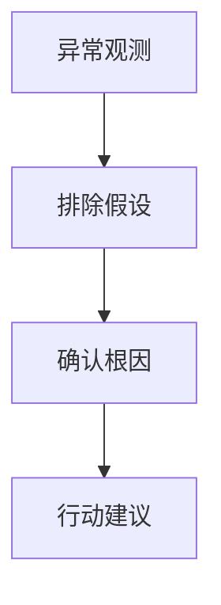

# 流量异常诊断报告

日期：
站点：
ASIN：
对比窗口：
数据来源：
置信度：

## 1. 一句话结论

结论：

最紧迫的单一行动：

## 2. 根因链路

## 3. 逐步推理

1. 观察到什么：
2. 排除了什么：
3. 确认了什么：
4. 还缺什么数据：

## 4. 核心证据

| 维度 | 观察 | 证据来源 | 判断 |
|---|---|---|---|
| 自然侧 |  |  |  |
| 广告侧 |  |  |  |
| 关键词侧 |  |  |  |
| 竞品侧 |  |  |  |
| 季节/大盘 |  |  |  |
| 转化/供给 |  |  |  |

## 5. 关键词异常表

| 关键词 | 搜索量 | 自然位变化 | 广告位变化 | SERP 现场 | 风险 |
|---|---:|---|---|---|---|

## 6. 竞品挤压表

| 关键词 | 竞品 ASIN | 位置 | Sponsored | 价格 | 评分/评论 | 对目标 ASIN 的影响 |
|---|---|---:|---|---:|---|---|

## 7. 代理指标

| 指标 | 当前 | 基线 | 变化 | 说明 |
|---|---:|---:|---:|---|
| organic_visibility_score |  |  |  | 自然可见度代理，不等同真实自然流量 |
| sponsored_visibility_score |  |  |  | 广告可见度代理，不等同真实广告点击 |
| competitor_pressure_score |  |  |  | 竞品压力代理 |
| anomaly_score |  |  |  | 综合异常分 |

## 8. 行动建议

| 优先级 | 动作 | 为什么 | 需要人工确认 |
|---|---|---|---|

## 9. 待验证项

- 

## 10. 使用情况

- Sorftime 调用：
- Pangolinfo 调用：
- 本地历史库：
- 未使用或不可用的数据源：
